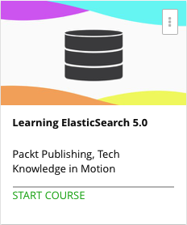

```
Roberto Nogueira  
BSd EE, MSd CE
Solution Integrator Experienced - Certified by Ericsson
```
# Udemy Learning ElasticSearch



**About **

Store, search, and analyze your data with ease using ElasticSearch 5.0.

[Homepage](https://www.udemy.com/learning-elasticsearch-50/)

## Topics
```
Section: 1
0 / 6
Getting Started with ElasticSearch
[x] 1. The Course Overview 3:08
[x] 2. What Is ElasticSearch? 4:01
[x] 3. Installing ElasticSearch 6:34
[x] 4. Goal of ElasticSearch 4:16
[x] 5. What's New in Version 5.0? 3:36
[x] 6. Why Use ElasticSearch? 5:10

Section: 2
0 / 4
Dichotomy of ElasticSearch
[ ] 7. What Is an Index? 2:31
[ ] 8. Documents in ElasticSearch 4:20
[ ] 9. What Is a Cluster? 6:51
[ ] 10. Setting Shards and Replicas 6:30

Section: 3
0 / 3
Get Going with Documents and Indices
[ ] 11. Adding and Deleting an Index 8:09
[ ] 12. Adding and Deleting Documents 5:33
[ ] 13. Using Bulk API 8:44

Section: 4
0 / 3
Querying with RESTful API
[ ] 14. Introduction to REST API 3:21
[ ] 15. Using REST API to Search 6:34
[ ] 16. Using REST API to Update 6:39

Section: 5
0 / 7
Power Your Searches with DSL
[ ] 17. Introduction to DSL 4:10
[ ] 18. Understanding DSL 3:09
[ ] 19. Term Queries and Boosting 7:13
[ ] 20. Range Query 2:27
[ ] 21. Exist Query 3:02
[ ] 22. Aggregation Based Analytics 6:41
[ ] 23. Aggregations: Implementation 4:45

Section: 6
0 / 1
What ElasticSearch is NOT
[ ] 24. Myths about ElasticSearch 8:39

Section: 7
0 / 5
Getting More with ElasticStack
[ ] 25. What Is ElasticStack? 1:47
[ ] 26. Kibana 5:24
[ ] 27. Logstash 3:49
[ ] 28. X-Pack 4:58
[ ] 29. Beats 1:53

Section: 8
0 / 2
Apache Log Analysis
[ ] 30. Preparing for Log Analysis 5:40
[ ] 31. Running Log Analysis 9:25

Section: 9
0 / 3
Advanced ElasticSearch Queries
[ ] 32. Sorting in ElasticSearch 4:33
[ ] 33. Geo Searching 2:51
[ ] 34. Getting into Synonyms 4:24

Section: 10
0 / 1
ElasticSearch versus Apache Solr
[ ] 35. Choosing between ElasticSearch and Apache Solr 4:45
```
